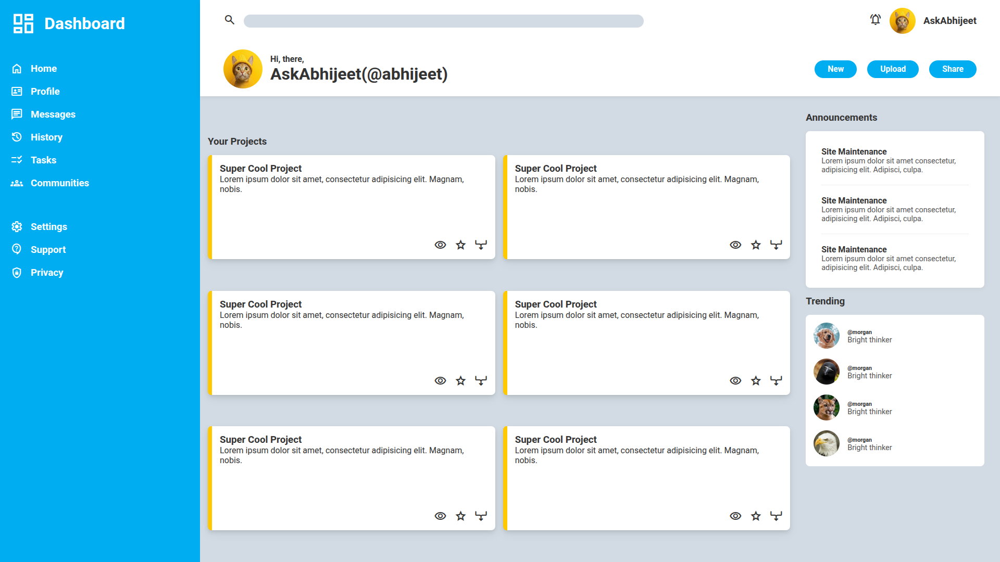

# Dashboard Design

A clean and modern **dashboard UI design** created with HTML and CSS. This project focuses on layout, color scheme, and user interface elements rather than backend functionality.  

---

## Features

- Header with search bar, notifications, and user profile
- Action bar with **New / Upload / Share** buttons
- Main content area with projects cards
- Right content bar for announcements and trending profiles
- Modern design using **CSS Grid** and **Flexbox**
- Custom color variables for easy theme adjustments
- Material icons for interactive elements
- Hover effects for buttons, cards, and sidebar items

---

## Technologies Used

- HTML5
- CSS3
- Google Fonts (`Roboto`, `Material Symbols Outlined`)

---

## Folder Structure

- /dashboard-design
- │
- ├─ index.html
- ├─ style.css
- ├─ resources/
- │      ├─ profile.png
- │      ├─ profile1.png
- │      ├─ profile2.png
- │      ├─ profile3.png
- │      ├─ profile4.png
- │      └─ dashboard-screenshot.png

---

## How to View

1. Clone or download this repository.
2. Open `index.html` in a web browser.
3. View the dashboard design locally.

---

## Notes

- This is a **UI/UX mockup**; no backend functionality is included.
- Colors and layout can be customized easily using the CSS variables defined in `style.css`.
